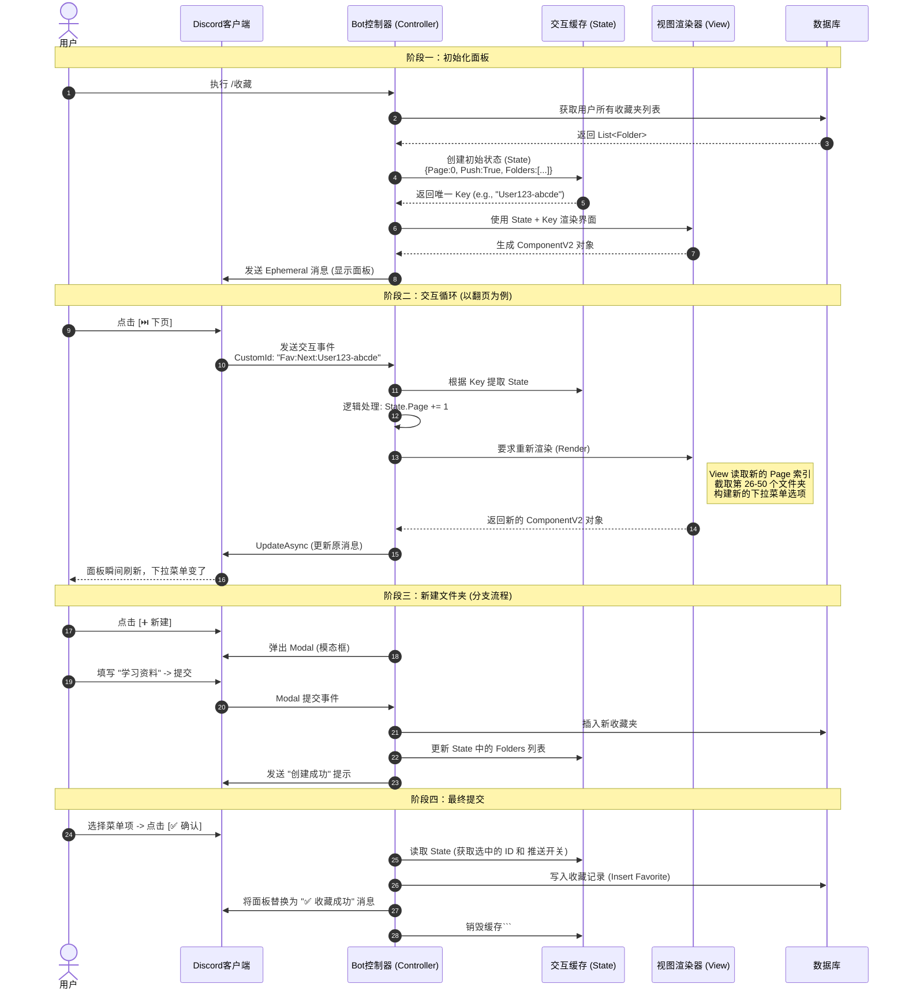

```mermaid
sequenceDiagram
    autonumber
    actor User as 用户
    participant Discord as Discord客户端
    participant Bot as Bot控制器 (Controller)
    participant Cache as 交互缓存 (State)
    participant View as 视图渲染器 (View)
    participant DB as 数据库

    Note over User, DB: 阶段一：初始化面板
    User->>Bot: 执行 /收藏
    Bot->>DB: 获取用户所有收藏夹列表
    DB-->>Bot: 返回 List<Folder>
    Bot->>Cache: 创建初始状态 (State)<br/>{Page:0, Push:True, Folders:[...]}
    Cache-->>Bot: 返回唯一 Key (e.g., "User123-abcde")
    Bot->>View: 使用 State + Key 渲染界面
    View-->>Bot: 生成 ComponentV2 对象
    Bot->>Discord: 发送 Ephemeral 消息 (显示面板)

    Note over User, DB: 阶段二：交互循环 (以翻页为例)
    User->>Discord: 点击 [⏭️ 下页]
    Discord->>Bot: 发送交互事件 <br/>CustomId: "Fav:Next:User123-abcde"
    
    Bot->>Cache: 根据 Key 提取 State
    Bot->>Bot: 逻辑处理: State.Page += 1
    
    Bot->>View: 要求重新渲染 (Render)
    Note right of View: View 读取新的 Page 索引<br/>截取第 26-50 个文件夹<br/>构建新的下拉菜单选项
    View-->>Bot: 返回新的 ComponentV2 对象
    
    Bot->>Discord: UpdateAsync (更新原消息)
    Discord-->>User: 面板瞬间刷新，下拉菜单变了

    Note over User, DB: 阶段三：新建文件夹 (分支流程)
    User->>Discord: 点击 [➕ 新建]
    Bot->>Discord: 弹出 Modal (模态框)
    User->>Discord: 填写 "学习资料" -> 提交
    Discord->>Bot: Modal 提交事件
    Bot->>DB: 插入新收藏夹
    Bot->>Cache: 更新 State 中的 Folders 列表
    Bot->>Discord: 发送 "创建成功" 提示

    Note over User, DB: 阶段四：最终提交
    User->>Discord: 选择菜单项 -> 点击 [✅ 确认]
    Bot->>Cache: 读取 State (获取选中的 ID 和 推送开关)
    Bot->>DB: 写入收藏记录 (Insert Favorite)
    Bot->>Discord: 将面板替换为 "✅ 收藏成功" 消息
    Bot->>Cache: 销毁缓存```
```